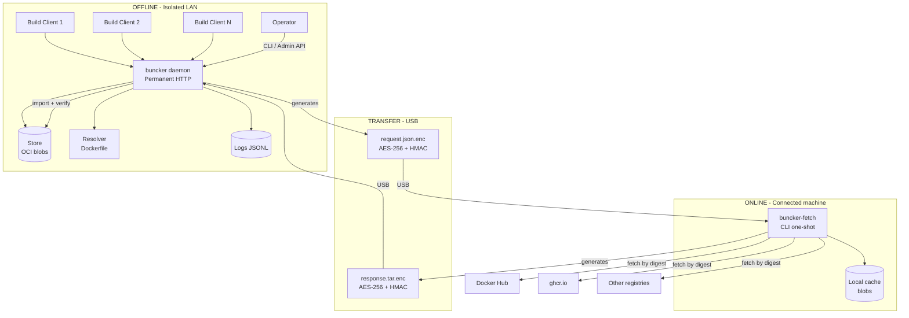
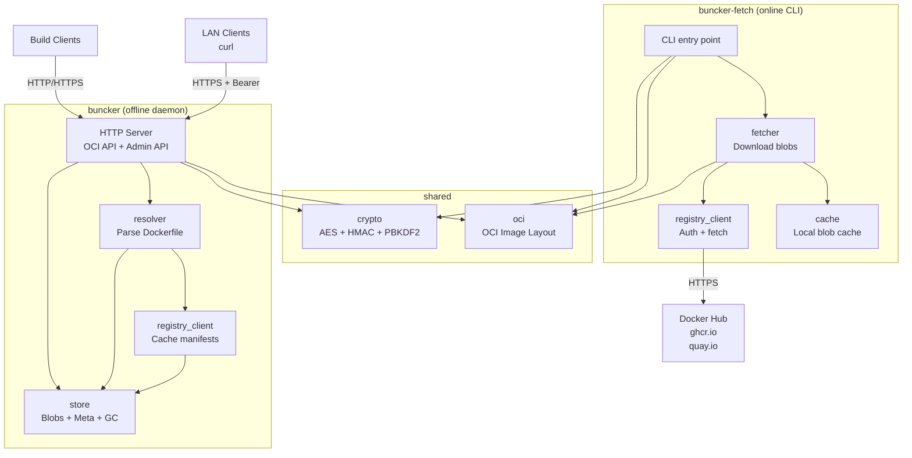
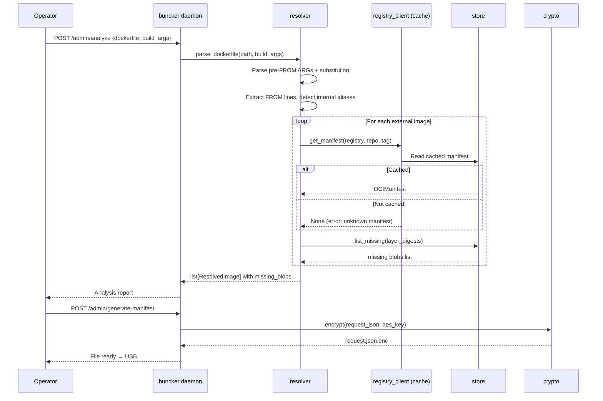
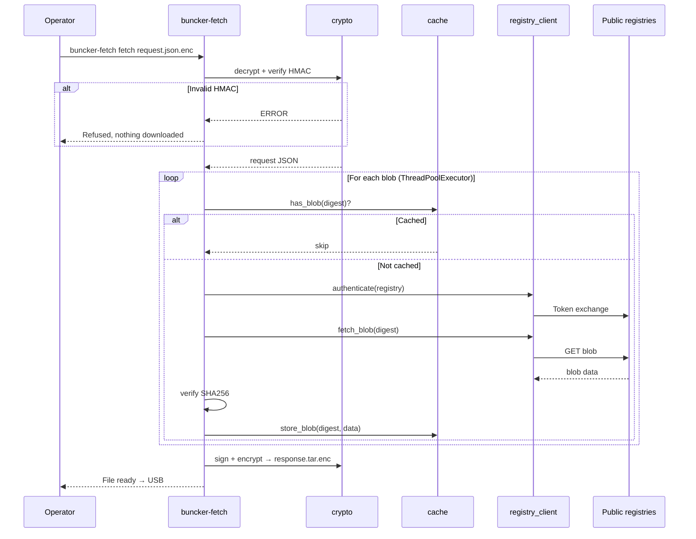
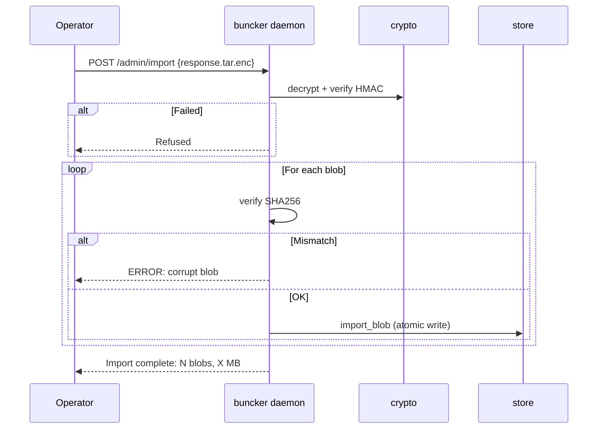
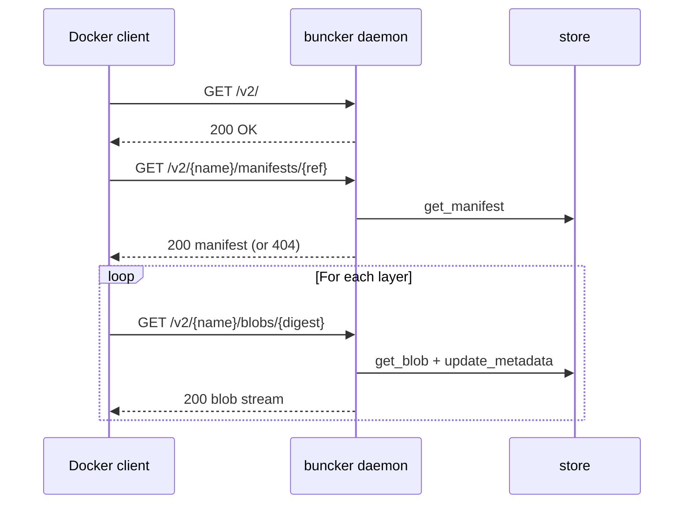
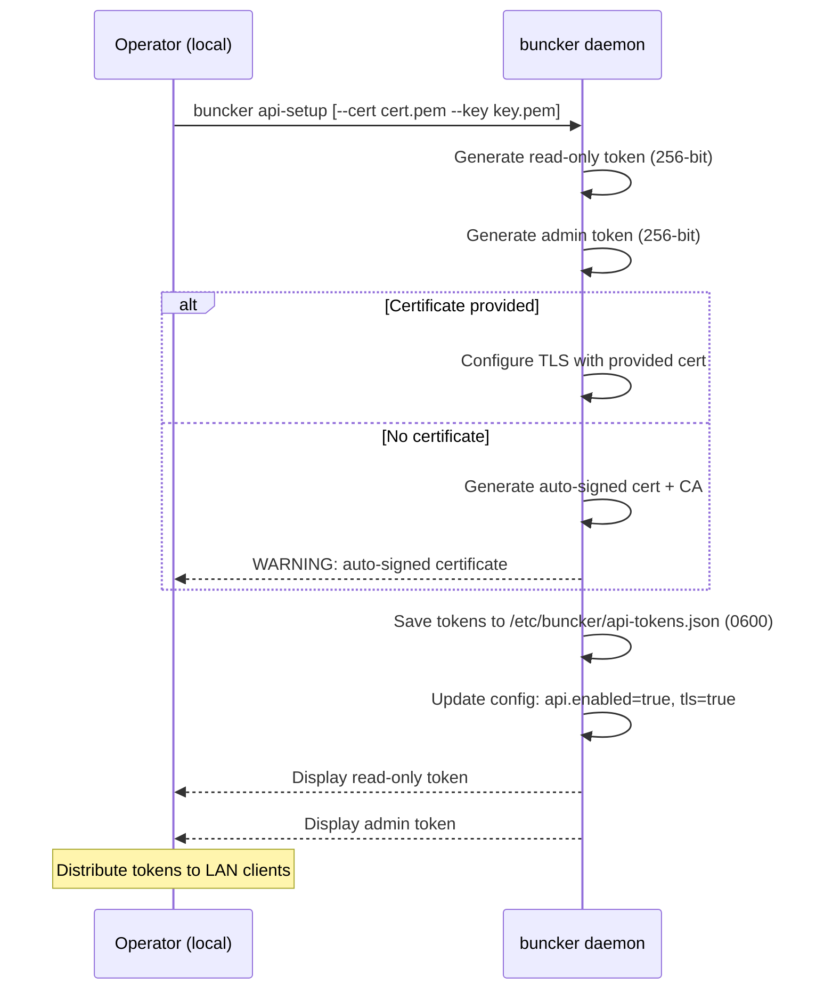
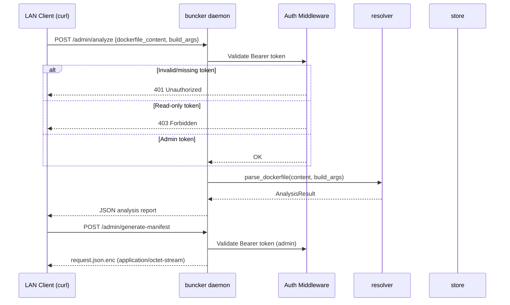
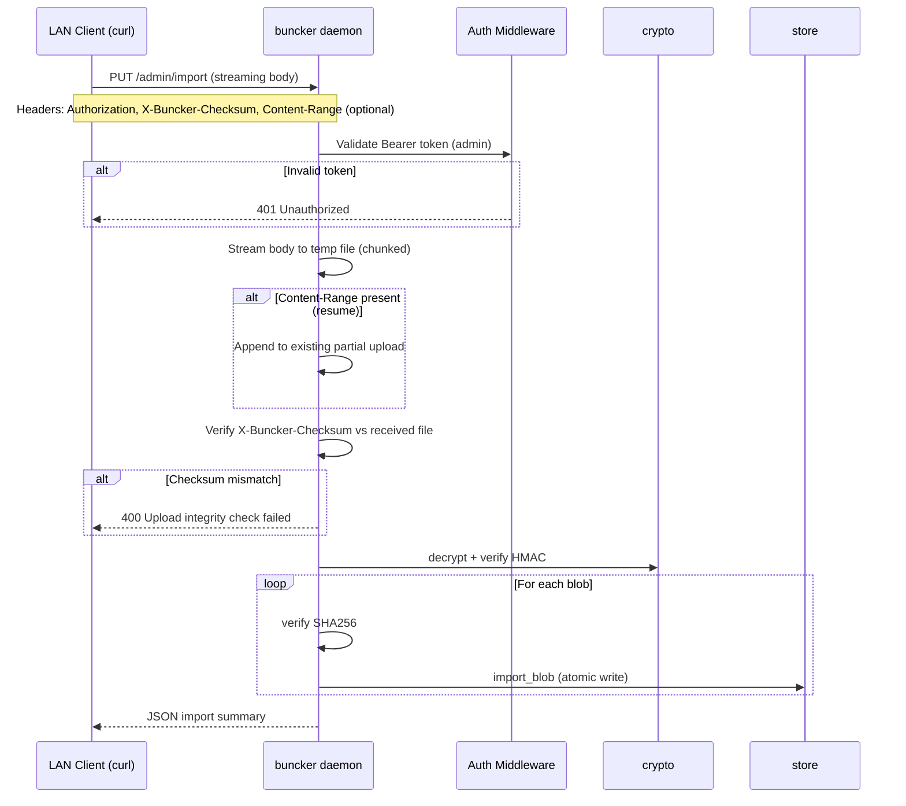

# Buncker Architecture Document

> Generated: 2026-03-06 | Version: 2.0 | Author: Romain G.

---

## 1. Introduction

This document outlines the overall project architecture for Buncker, a surgical Docker layer synchronization system for air-gapped environments. It serves as the guiding architectural blueprint for AI-driven development, ensuring consistency and adherence to chosen patterns and technologies.

### Starter Template

**N/A** - Greenfield project, no starter template. Built from scratch in pure Python with `.deb` packaging for both offline and online components.

### Change Log

| Date | Version | Description | Author |
|------|---------|-------------|--------|
| 2026-03-04 | 1.0 | Initial architecture document | Romain G. |
| 2026-03-06 | 2.0 | Added Admin API authentication, TLS, LAN client operations, streaming import | Romain G. |

---

## 2. High Level Architecture

### Technical Summary

Buncker is a surgical Docker layer synchronization system for air-gapped environments, architected as two independent components communicating exclusively via encrypted files on physical media (USB). The offline side is a **permanent HTTP daemon** exposing the OCI Distribution API (for Docker pulls) and an administration API (Dockerfile analysis, manifest generation, import, GC, logs). The online side is a stateless one-shot CLI that fetches missing blobs from public registries. The entire system runs on Python 3 + stdlib with `python3-cryptography` as the sole external dependency, packaged as `.deb`. Transfer channel security is ensured by AES-256 + HMAC-SHA256 symmetric crypto derived from a BIP-39 mnemonic shared once.

### High Level Overview

1. **Architectural Style:** Permanent HTTP daemon (offline) + one-shot CLI (online). Two fully decoupled components.
2. **Repository:** Monorepo with two packages (`buncker/` and `buncker_fetch/`) + shared code (`shared/`)
3. **Service Architecture:** The offline registry is a **permanent daemon** exposing:
   - OCI Distribution API (pull subset) for Docker build clients
   - Admin API: `analyze`, `generate-manifest`, `import`, `status`, `gc`, `logs`
4. **Primary Flow:**
   - Operator analyzes Dockerfile(s) → list of missing blobs
   - Generation of `request.json.enc` (encrypted) → USB
   - Online: `buncker-fetch fetch request.json.enc` → downloads → `response.tar.enc` → USB
   - Offline: import → verification → store → Docker builds work
5. **Key Decisions:** No internet fallback (miss = error), manual GC only, deduplication at manifest level, symmetric crypto (no PKI)
6. **V2 - LAN Client Operations:** Optional Bearer token authentication on admin API via `buncker api-setup`. Two access levels (read-only, admin). TLS mandatory when auth enabled. LAN clients interact via curl - no new binary needed

### High Level Project Diagram



### Architectural and Design Patterns

- **Daemon HTTP Pattern:** buncker runs as a permanent systemd service, serving the OCI API to Docker clients and exposing administration endpoints. _Rationale:_ Build clients need to pull at any time without manual intervention.

- **CLI One-Shot Pattern:** buncker-fetch is purely stateless, one-shot execution by the operator. _Rationale:_ No daemon to maintain on the connected machine.

- **OCI Distribution Spec (subset):** The offline registry implements only the endpoints necessary for `docker pull` (GET/HEAD manifest, GET/HEAD blob). _Rationale:_ Minimal subset = less code, fewer bugs.

- **Store Pattern (OCI Image Layout):** Blobs are stored per OCI Image Layout standard (`blobs/sha256/{digest}`). _Rationale:_ Standard format, verifiable by digest, compatible with other OCI tools.

- **Shared-Nothing Transfer:** The two sides never communicate over a network. The only channel is an encrypted file on USB. _Rationale:_ Real air-gap, no hidden channel risk, full auditability.

- **Symmetric Crypto (Pre-Shared Key):** AES-256 + HMAC-SHA256 derived from a BIP-39 mnemonic shared once. _Rationale:_ No PKI to manage, no certificates to renew, adapted to a context where both endpoints are controlled by the same organization.

- **Delta Sync:** Only missing blobs are requested. The transfer manifest is a diff between the local store and Dockerfile needs. _Rationale:_ Core value proposition vs Hauler (bulk snapshot). Bandwidth and time savings.

- **Optional Bearer Token Auth (V2):** Two-tier Bearer tokens (read-only / admin) on `/admin/*` endpoints, activated via `buncker api-setup`. `/v2/*` OCI endpoints remain unauthenticated. _Rationale:_ LAN clients (VMs, remote racks) need remote access to admin operations. Tokens are cryptographically random (256-bit), not derived from the mnemonic - separate security domain.

- **TLS Enforcement with Auth:** When auth is enabled, TLS is mandatory (operator-provided cert or auto-signed). _Rationale:_ Bearer tokens in cleartext over HTTP = interceptable. Auto-signed reuses existing `export-ca` mechanism.

- **Streaming Upload Pattern (V2):** Large file imports (`response.tar.enc`, potentially multi-GB) use PUT with chunked write-to-disk and `Content-Range` resume support. _Rationale:_ Buncker may run in a VM/rack/DC where USB is impractical. LAN transfers of multi-GB files must not load entirely in memory and must survive interruptions.

---

## 3. Tech Stack

### Cloud Infrastructure

**N/A** - Buncker is 100% on-premise by design. No cloud provider, no SaaS.

### Technology Stack Table

| Category | Technology | Version | Purpose | Rationale |
|----------|-----------|---------|---------|-----------|
| **Language** | Python | >=3.11 | Sole language for both packages | Rich stdlib, native on Debian 12 |
| **Crypto** | python3-cryptography | >=41.0 (apt) | AES-256-GCM, optional TLS cert gen | Only external dependency. Installed via apt, not pip |
| **HTTP Server** | ThreadingHTTPServer + ThreadPoolExecutor | stdlib | Permanent daemon for OCI + Admin API | Zero dependency. Bounded thread pool (max_workers=16 configurable) |
| **HTTP Client** | urllib.request | stdlib | Fetch blobs from public registries | Native HTTPS, certificate verification by default |
| **Hashing** | hashlib | stdlib | SHA256 (blob digests), PBKDF2 (key derivation) | Standard, performant |
| **Auth Signatures** | hmac | stdlib | HMAC-SHA256 (transfer manifest integrity) | stdlib, standard crypto |
| **Concurrency** | concurrent.futures | stdlib | ThreadPoolExecutor for parallel fetch | stdlib, simple, sufficient for I/O-bound |
| **Logging** | logging | stdlib | Structured JSON Lines logs | stdlib, configurable handlers |
| **Arg Parsing** | argparse | stdlib | CLI for both tools | stdlib, subcommands support |
| **Packaging (offline)** | dpkg / .deb | - | buncker distribution on Debian/Ubuntu | Native apt dependency management |
| **Packaging (online)** | dpkg / .deb | - | buncker-fetch distribution on Debian/Ubuntu | Same format, consistency |
| **Service Manager** | systemd | - | buncker offline daemon | Standard on Debian 12+, auto-restart, journald |
| **Testing** | pytest | 8.x | Unit and integration tests | Dev only, not in .deb |
| **Linting** | ruff | 0.8.x | Linting + formatting | Fast, replaces flake8+black+isort |

---

## 4. Data Models

### OCI Blob (Store)

**Purpose:** Represents a layer or config blob in the local store

**Key Attributes:**
- `digest`: string (`sha256:abc123...`) - unique identifier, filename
- `size`: int - size in bytes
- `media_type`: string - OCI type
- `image_refs`: list[string] - images referencing this blob
- `first_imported`: datetime ISO
- `last_requested`: datetime ISO - last pull by a build client
- `request_count`: int - number of pulls
- `gc_status`: enum (`active` | `gc_candidate`)

**Persistence:** Blob = file in `store/blobs/sha256/{digest_hex}`. Metadata = JSON sidecar `store/meta/{digest_hex}.json`

### OCI Manifest (Store)

**Purpose:** Image manifest for a given platform (link between tag and blobs)

**Key Attributes:**
- `digest`, `registry`, `repository`, `tag`, `platform`
- `config_digest`: string - config blob digest
- `layers`: list[string] - ordered layer digests
- `cached_at`: datetime ISO

**Persistence:** `store/manifests/{registry}/{repository}/{tag}/{platform}.json`

### Transfer Request

**Purpose:** Transfer manifest generated by offline, consumed by online

**Key Attributes:**
- `version`: string (`1`)
- `buncker_version`: string - for auto-update check
- `generated_at`: datetime ISO
- `source_id`: string
- `blobs`: list[{registry, repository, digest, size, media_type}]

**Persistence:** `.json.enc` file (AES-256 encrypted JSON + HMAC)

### Transfer Response

**Purpose:** OCI package containing requested blobs, produced by online

**Key Attributes:**
- `oci-layout`, `index.json`, `blobs/sha256/...`, `MANIFEST.sig`, `ERRORS.json`

**Persistence:** `.tar.enc` archive (AES-256 encrypted tar + HMAC)

### Crypto Config

**Purpose:** Persistent crypto configuration on both sides

**Offline:** `source_id`, `mnemonic_hash`, `salt`, `created_at`, `rotated_at`, `grace_period_days`
**Online:** `derived_key_check`, `salt`, `registries` (credentials via env vars)

**Persistence:** `config.json` (offline: `/etc/buncker/`, online: `~/.buncker/`)

### Resolved Dockerfile (in-memory)

**Purpose:** Result of Dockerfile analysis - not persisted

**Key Attributes:**
- `source_path`, `build_args`, `images`: list[ResolvedImage] with `raw`, `resolved`, `registry`, `repository`, `tag`, `digest`, `platform`, `alias`, `is_internal`, `is_private`, `missing_blobs`

### API Token Config (V2)

**Purpose:** Bearer tokens for admin API authentication

**Key Attributes:**
- `readonly`: string - 256-bit hex token for read-only access
- `admin`: string - 256-bit hex token for full admin access

**Persistence:** `/etc/buncker/api-tokens.json` (mode 0600). Only exists after `buncker api-setup`.

---

## 5. Components

### buncker - HTTP Daemon (offline)

**Responsibility:** Central point of the isolated LAN. Serves Docker images to build clients and exposes store administration.

**Key Interfaces:**
- **OCI Distribution API (pull subset)** - configurable port (default 5000), always unauthenticated
  - `GET /v2/` - version check
  - `GET /v2/{name}/manifests/{reference}` - fetch manifest
  - `HEAD /v2/{name}/manifests/{reference}` - check existence
  - `GET /v2/{name}/blobs/{digest}` - fetch blob
  - `HEAD /v2/{name}/blobs/{digest}` - check blob existence
- **Admin API** - same port, `/admin/` prefix, optional Bearer token auth (V2)
  - `POST /admin/analyze`, `POST /admin/generate-manifest`, `POST /admin/import` (local POST), `PUT /admin/import` (remote streaming)
  - `GET /admin/status`, `GET /admin/gc/report`, `POST /admin/gc/execute`, `GET /admin/logs`
- **Auth Middleware (V2)** - validates Bearer tokens on `/admin/*` when `api.enabled: true`
  - Read-only token: `status`, `logs`, `gc/report`
  - Admin token: all `/admin/*` endpoints
- **Management CLI** - local-only commands (not exposed via HTTP)
  - `buncker api-setup` - generate tokens, activate TLS
  - `buncker api-show readonly|admin` - display token
  - `buncker api-reset readonly|admin` - regenerate token

**Dependencies:** None. Self-contained.

### buncker-fetch - CLI (online)

**Responsibility:** Downloads missing blobs from public registries, produces response.tar.enc.

**Key Interfaces:**
- `buncker-fetch pair` - mnemonic setup
- `buncker-fetch inspect <request.json.enc>` - display contents
- `buncker-fetch fetch <request.json.enc> [--output] [--parallelism N]`
- `buncker-fetch status` - local cache state
- `buncker-fetch cache clean [--older-than Nd]`

**Dependencies:** Outbound HTTPS to public registries.

### shared/crypto

**Responsibility:** All crypto logic, identical on both sides.

**Interfaces:** `generate_mnemonic()`, `derive_keys()`, `encrypt()`, `decrypt()`, `sign()`, `verify()`

**Dependencies:** `python3-cryptography` (apt) for AES-256-GCM. Rest = stdlib.

### shared/oci

**Responsibility:** OCI Image Layout manipulation.

**Interfaces:** `parse_manifest()`, `parse_index()`, `build_image_layout()`, `verify_blob()`, `select_platform()`

**Dependencies:** stdlib only.

### buncker/resolver

**Responsibility:** Static Dockerfile analysis, FROM resolution.

**Interfaces:** `parse_dockerfile()`, `parse_args()`, `resolve_from()`

### buncker/registry_client (offline)

**Responsibility:** Reads cached manifests. NO network requests.

### buncker-fetch/registry_client (online)

**Responsibility:** Auth discovery + Bearer token + fetch from public registries.

### buncker/store

**Responsibility:** OCI blob store management (blobs + metadata + GC).

**Interfaces:** `has_blob()`, `get_blob()`, `import_blob()`, `list_missing()`, `update_metadata()`, `gc_report()`, `gc_execute()`

### Component Diagram



---

## 6. External APIs

All public registries follow the OCI Distribution Spec. buncker-fetch implements a single client with auth discovery:

```
1. GET /v2/ → 401 + Www-Authenticate header → parse realm/service/scope
2. GET {realm}?service={service}&scope={scope} → Bearer token
3. GET /v2/{name}/manifests/{ref} + OCI Accept headers
4. GET /v2/{name}/blobs/{digest} → binary stream
```

**Registries supported:** docker.io, ghcr.io, quay.io, gcr.io, any OCI-compliant custom registry.

**Retry policy:** 3 attempts, exponential backoff (1s, 3s, 9s).
**Timeout:** 30s connect, 120s read.
**Rate limits:** Docker Hub 100 pulls/6h anonymous, 200/6h authenticated. Mitigated by local manifest cache.

---

## 7. Core Workflows

### Workflow 1 - Dockerfile Analysis + Request Generation



### Workflow 2 - Online Fetch



### Workflow 3 - Import Response (offline)



### Workflow 4 - Docker Pull



### Workflow 5 - Setup / Pairing

```mermaid
sequenceDiagram
    participant OFF as Operator (offline)
    participant D as buncker daemon
    participant ON as Operator (online)
    participant F as buncker-fetch

    OFF->>D: buncker setup
    D->>D: generate_mnemonic() → 16 BIP-39 words (12 secret + 4 salt)
    D->>D: derive_keys + save config
    D-->>OFF: Display 16 words (write on paper)
    Note over OFF,ON: Human channel (verbal, paper)
    ON->>F: buncker-fetch pair
    F-->>ON: Enter 16 words
    ON->>F: word1 word2 ... word16
    F->>F: derive_keys + save config
    F-->>ON: Pairing OK
```

### Workflow 6 - API Setup (V2)



### Workflow 7 - Remote Analysis via curl (V2)



### Workflow 8 - Remote Streaming Import via curl (V2)



---

## 8. REST API Spec

### OCI Distribution API (pull subset)

| Method | Path | Purpose | Auth |
|--------|------|---------|------|
| GET | `/v2/` | Version check | None |
| GET | `/v2/{name}/manifests/{reference}` | Fetch manifest | None |
| HEAD | `/v2/{name}/manifests/{reference}` | Check manifest existence | None |
| GET | `/v2/{name}/blobs/{digest}` | Fetch blob | None |
| HEAD | `/v2/{name}/blobs/{digest}` | Check blob existence | None |

Required headers on responses: `Docker-Content-Digest`, `Content-Type`, `Content-Length`.

OCI endpoints are **always unauthenticated** regardless of auth configuration.

### Admin API

| Method | Path | Purpose | Auth (V2) |
|--------|------|---------|-----------|
| POST | `/admin/analyze` | Analyze Dockerfile(s) - accepts `dockerfile_path` (localhost) or `dockerfile_content` (remote) | Admin |
| POST | `/admin/generate-manifest` | Generate request.json.enc - returns file in response body | Admin |
| POST | `/admin/import` | Import response.tar.enc (local CLI, multipart/form-data) | Admin |
| PUT | `/admin/import` | Streaming upload of response.tar.enc (remote, `curl -T`) | Admin |
| GET | `/admin/status` | Store state + disk usage | Read-only |
| GET | `/admin/gc/report` | GC candidates report | Read-only |
| POST | `/admin/gc/execute` | Execute GC (requires operator + digests) | Admin |
| GET | `/admin/logs` | Query logs (filter by event, since, limit) | Read-only |

#### Authentication (V2 - after `buncker api-setup`)

When `api.enabled: true` in config, all `/admin/*` requests require `Authorization: Bearer <token>`.

| Response | Condition |
|----------|-----------|
| 401 Unauthorized | Missing or invalid token |
| 403 Forbidden | Valid read-only token on an admin-only endpoint |

When `api.enabled: false` (default, no `api-setup` run), all endpoints behave as V1 (no auth).

#### PUT /admin/import - Streaming Upload

| Header | Required | Purpose |
|--------|----------|---------|
| `Authorization: Bearer <token>` | Yes (when auth enabled) | Admin token |
| `X-Buncker-Checksum: sha256:<hex>` | Yes | Pre-decryption integrity check |
| `Content-Range: bytes <start>-<end>/<total>` | No | Resume partial upload |
| `Content-Length` | Yes | Total body size |

The daemon writes the body to disk in chunks (never loads entirely in memory). After upload, it verifies the checksum before running the standard import pipeline.

#### Audit Log Fields (V2)

All API requests are logged with additional fields:

| Field | Values |
|-------|--------|
| `client_ip` | Source IP address |
| `auth_level` | `admin`, `readonly`, `local`, `rejected` |
| `user_agent` | User-Agent header value |

---

## 9. Storage Schema

### Store offline (`/var/lib/buncker/`)

```
/var/lib/buncker/
├── oci-layout
├── index.json
├── blobs/sha256/
│   ├── a1b2c3d4e5...
│   └── ...
├── meta/sha256/
│   ├── a1b2c3d4e5...json
│   └── ...
├── manifests/{registry}/{repo}/{tag}/{platform}.json
└── logs/buncker.jsonl
```

### Config offline (`/etc/buncker/config.json`)

```json
{
  "source_id": "buncker-prod-01",
  "bind": "0.0.0.0",
  "port": 5000,
  "store_path": "/var/lib/buncker",
  "max_workers": 16,
  "tls": false,
  "crypto": { "salt": "base64...", "mnemonic_hash": "sha256:..." },
  "api": { "enabled": false },
  "private_registries": ["registry.internal", "localhost:*"],
  "gc": { "inactive_days_threshold": 90 },
  "log_level": "INFO"
}
```

When `api.enabled: true` (after `buncker api-setup`), `tls` is also set to `true`.

### API tokens (`/etc/buncker/api-tokens.json`, mode 0600)

```json
{
  "readonly": "hex-encoded-256-bit-token",
  "admin": "hex-encoded-256-bit-token"
}
```

This file only exists after `buncker api-setup`. It is never readable by non-root users.

### Cache online (`~/.buncker/`)

```
~/.buncker/
├── config.json
├── cache/blobs/sha256/
└── logs/fetch.jsonl
```

---

## 10. Source Tree

```
buncker/
├── README.md
├── LICENSE
├── Makefile
├── shared/
│   ├── __init__.py
│   ├── crypto.py
│   ├── oci.py
│   └── wordlist.py
├── buncker/
│   ├── __init__.py
│   ├── __main__.py
│   ├── server.py
│   ├── handler.py
│   ├── auth.py
│   ├── resolver.py
│   ├── registry_client.py
│   ├── store.py
│   ├── transfer.py
│   └── config.py
├── buncker_fetch/
│   ├── __init__.py
│   ├── __main__.py
│   ├── fetcher.py
│   ├── registry_client.py
│   ├── cache.py
│   ├── transfer.py
│   └── config.py
├── tests/
│   ├── conftest.py
│   ├── shared/
│   │   ├── test_crypto.py
│   │   └── test_oci.py
│   ├── buncker/
│   │   ├── test_resolver.py
│   │   ├── test_store.py
│   │   ├── test_handler.py
│   │   ├── test_auth.py
│   │   ├── test_transfer.py
│   │   └── test_server_integration.py
│   └── buncker_fetch/
│       ├── test_fetcher.py
│       ├── test_registry_client.py
│       ├── test_cache.py
│       └── test_transfer.py
├── packaging/
│   ├── buncker/debian/
│   │   ├── control
│   │   ├── rules
│   │   ├── install
│   │   ├── buncker.service
│   │   ├── postinst
│   │   └── conffiles
│   └── buncker-fetch/debian/
│       ├── control
│       ├── rules
│       └── install
├── pyproject.toml
└── .gitignore
```

---

## 11. Infrastructure and Deployment

### Deployment Strategy

- **Strategy:** Manual .deb installation (air-gap requirement)
- **CI/CD:** GitHub Actions - lint → test → build .deb → artifacts
- **Auto-update:** request.json.enc includes `buncker_version`. buncker-fetch includes newer .deb in response.tar.enc if available. Manual install by operator.

### Environments

- **Dev:** Local machine, `python3 -m buncker`, store in `/tmp/buncker-dev/`
- **CI:** GitHub Actions, Ubuntu latest
- **Production offline:** Debian 12+ dedicated machine, systemd service
- **Production online:** Operator workstation, Debian 12+

### systemd Unit

```ini
[Unit]
Description=Buncker - Offline Docker Registry
After=network.target

[Service]
Type=simple
User=buncker
Group=buncker
ExecStart=/usr/bin/buncker serve
Restart=on-failure
RestartSec=5
WorkingDirectory=/var/lib/buncker
NoNewPrivileges=yes
ProtectSystem=strict
ProtectHome=yes
ReadWritePaths=/var/lib/buncker /var/log/buncker
PrivateTmp=yes

[Install]
WantedBy=multi-user.target
```

### Rollback

`dpkg -i buncker_<previous_version>.deb`. Store persists across upgrades. Config protected via `conffiles`.

---

## 12. Error Handling Strategy

### Exception Hierarchy

```python
class BunckerError(Exception): ...
class ConfigError(BunckerError): ...
class CryptoError(BunckerError): ...
class StoreError(BunckerError): ...
class ResolverError(BunckerError): ...
class RegistryError(BunckerError): ...
class TransferError(BunckerError): ...
```

### Key Principles

- **Atomic writes:** temp file + SHA256 verify + rename. Never corrupt the store.
- **Actionable errors:** Every error message includes what failed, context, and what to do.
- **Retry policy (online):** 3 attempts, exponential backoff (1s, 3s, 9s). Connect 30s, read 120s.
- **Partial import:** Valid blobs are kept. Failed blobs are reported. Operator can retry.
- **Idempotent:** Importing the same blob twice = noop (same digest = same file).

### Logging

- **Format:** JSON Lines, append-only
- **Levels:** DEBUG, INFO, WARNING, ERROR
- **Events:** `dockerfile_analyzed`, `transfer_manifest_generated`, `transfer_imported`, `blob_pulled`, `blob_missing`, `gc_candidate`, `gc_executed`, `key_rotation`, `api_auth_rejected`, `api_token_reset`, `api_setup_completed`
- **V2 fields on API requests:** `client_ip`, `auth_level` (`admin`, `readonly`, `local`, `rejected`), `user_agent`
- **Never log:** mnemonic, derived keys, Bearer tokens, passwords

---

## 13. Coding Standards

### Core Standards

- **Language:** Python >=3.11
- **Linting:** ruff (`E,F,W,I,UP,B,SIM`)
- **Tests:** pytest, `tests/` mirroring source structure

### Critical Rules

1. **No pip, no venv:** Only stdlib + `python3-cryptography`. Whitelist of allowed imports enforced.
2. **Atomic writes only:** All store writes via temp + verify + rename.
3. **SHA256 verify on every blob read/write:** No exceptions, no skip.
4. **No secrets in logs:** Never log mnemonic, keys, tokens.
5. **Errors must be actionable:** What failed + context + what to do.
6. **No internet fallback (offline):** No `urllib.request.urlopen` in `buncker/` package. Ever.
7. **OCI compliance:** Manifests, index, blobs follow OCI Image Spec. `_buncker` is the only allowed extension.
8. **HTTP responses match OCI Distribution Spec:** Required headers must be present and correct.

### Python Specifics

- Type hints on public signatures
- `@dataclass` for data structures crossing module boundaries
- f-strings only (no `%` or `.format()`)
- `pathlib.Path` for paths (except `os.rename` for atomic writes)

---

## 14. Test Strategy

- **Philosophy:** Test-after. 80% coverage minimum, 100% on crypto.
- **Pyramid:** 70% unit, 25% integration, 5% e2e.
- **Framework:** pytest 8.x, `unittest.mock` for mocking.
- **Integration:** Temp directories, localhost HTTP server, mock OCI registry.
- **E2E:** Full cycle (setup → analyze → generate → fetch → import → pull) in CI.
- **CI Pipeline:** `ruff check → ruff format --check → pytest (unit) → pytest (integration) → pytest (e2e) → coverage`

---

## 15. Security

### Input Validation
- Digest format: `^sha256:[a-f0-9]{64}$`
- Tag format: `^[a-zA-Z0-9._-]{1,128}$`
- Path traversal prevention on Dockerfile paths (localhost only in V2 - remote sends content, not path)
- No eval, no shell execution of build-args
- `X-Buncker-Checksum` header validated before any decryption attempt

### Authentication

#### Transfer channel (mnemonic)
- BIP-39 mnemonic shared once via human channel
- Derives AES + HMAC keys for USB transfer encryption
- Unchanged in V2

#### Admin API (V2 - Bearer tokens)
- Activated by `buncker api-setup` (optional)
- Two cryptographically random tokens (256-bit, `secrets.token_hex(32)`)
  - **Read-only**: `status`, `logs`, `gc/report`
  - **Admin**: all `/admin/*` endpoints
- Token comparison: constant-time (`hmac.compare_digest`)
- Tokens stored in `/etc/buncker/api-tokens.json` (mode 0600)
- Token management: `buncker api-show|api-reset readonly|admin` (local CLI only)
- Failed auth logged with `auth_level: rejected` - no information leakage about token validity

#### OCI Distribution API
- Always unauthenticated (`/v2/*`) - Docker clients pull without tokens
- Online: registry credentials via env vars only, never plaintext in config

### Secrets Management
- Mnemonic: communicated once via human channel, never stored in cleartext
- Derived keys: in-memory only during execution, never written to disk
- Config stores only verification hashes and salts
- API tokens: separate from mnemonic, stored in restricted file (0600), not derived from mnemonic
- Logs NEVER contain: mnemonic, derived keys, Bearer tokens, passwords

### Data Protection
- Transfer files (USB): AES-256-GCM + HMAC-SHA256, always encrypted
- LAN: TLS mandatory when API auth is enabled. HTTP allowed only without auth (local-only usage)
- Internet (buncker-fetch): HTTPS mandatory
- Store blobs: cleartext on disk (disk encryption is OS responsibility)
- TLS: operator-provided certificate (internal/external CA) or auto-signed with explicit security warning

### Dependency Security
- Single dependency: `python3-cryptography` (Debian-maintained)
- Any new dependency requires explicit justification + Debian package availability

---

## 16. Next Steps

1. **Product Owner review** of this architecture document
2. **Story creation** - Use `/pm` then `/create-next-story` to build an ordered backlog
3. **Implementation order suggestion:**
   - Epic 1: shared/crypto + shared/oci (foundation)
   - Epic 2: buncker/store (core storage)
   - Epic 3: buncker/resolver (Dockerfile parsing)
   - Epic 4: buncker/server + handler (daemon HTTP)
   - Epic 5: buncker/transfer (request generation + response import)
   - Epic 6: buncker-fetch (online CLI, complete)
   - Epic 7: packaging (.deb + systemd + CI)
   - Epic 8: e2e tests + documentation
4. **No frontend architecture needed** - both components are CLI/daemon only
