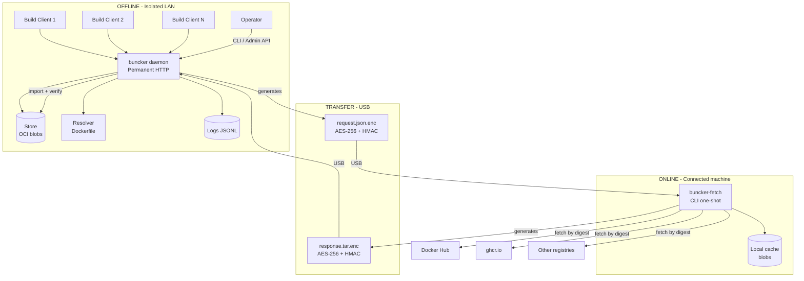

# 2. High Level Architecture

## Technical Summary

Buncker is a surgical Docker layer synchronization system for air-gapped environments, architected as two independent components communicating exclusively via encrypted files on physical media (USB). The offline side is a **permanent HTTP daemon** exposing the OCI Distribution API (for Docker pulls) and an administration API (Dockerfile analysis, manifest generation, import, GC, logs). The online side is a stateless one-shot CLI that fetches missing blobs from public registries. The entire system runs on Python 3 + stdlib with `python3-cryptography` as the sole external dependency, packaged as `.deb`. Transfer channel security is ensured by AES-256 + HMAC-SHA256 symmetric crypto derived from a BIP-39 mnemonic shared once.

## High Level Overview

1. **Architectural Style:** Permanent HTTP daemon (offline) + one-shot CLI (online). Two fully decoupled components.
2. **Repository:** Monorepo with two packages (`buncker/` and `buncker_fetch/`) + shared code (`shared/`)
3. **Service Architecture:** The offline registry is a **permanent daemon** exposing:
   - OCI Distribution API (pull subset) for Docker build clients
   - Admin API: `analyze`, `generate-manifest`, `import`, `status`, `gc`, `logs`
4. **Primary Flow:**
   - Operator analyzes Dockerfile(s) → list of missing blobs
   - Generation of `request.json.enc` (encrypted) → USB
   - Online: `buncker-fetch fetch request.json.enc` → downloads → `response.tar.enc` → USB
   - Offline: import → verification → store → Docker builds work
5. **Key Decisions:** No internet fallback (miss = error), manual GC only, deduplication at manifest level, symmetric crypto (no PKI)

## High Level Project Diagram

## Architectural and Design Patterns

- **Daemon HTTP Pattern:** buncker runs as a permanent systemd service, serving the OCI API to Docker clients and exposing administration endpoints. _Rationale:_ Build clients need to pull at any time without manual intervention.

- **CLI One-Shot Pattern:** buncker-fetch is purely stateless, one-shot execution by the operator. _Rationale:_ No daemon to maintain on the connected machine.

- **OCI Distribution Spec (subset):** The offline registry implements only the endpoints necessary for `docker pull` (GET/HEAD manifest, GET/HEAD blob). _Rationale:_ Minimal subset = less code, fewer bugs.

- **Store Pattern (OCI Image Layout):** Blobs are stored per OCI Image Layout standard (`blobs/sha256/{digest}`). _Rationale:_ Standard format, verifiable by digest, compatible with other OCI tools.

- **Shared-Nothing Transfer:** The two sides never communicate over a network. The only channel is an encrypted file on USB. _Rationale:_ Real air-gap, no hidden channel risk, full auditability.

- **Symmetric Crypto (Pre-Shared Key):** AES-256 + HMAC-SHA256 derived from a BIP-39 mnemonic shared once. _Rationale:_ No PKI to manage, no certificates to renew, adapted to a context where both endpoints are controlled by the same organization.

- **Delta Sync:** Only missing blobs are requested. The transfer manifest is a diff between the local store and Dockerfile needs. _Rationale:_ Core value proposition vs Hauler (bulk snapshot). Bandwidth and time savings.

---
