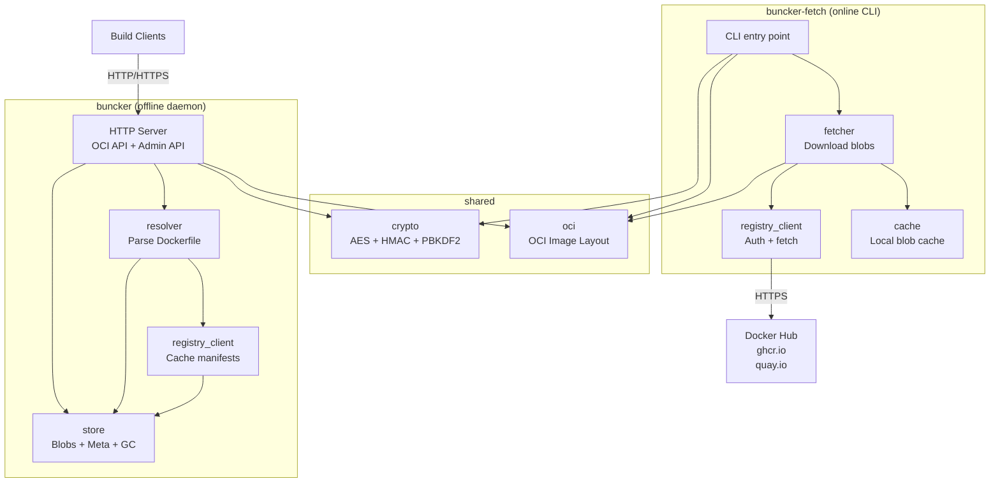

# 5. Components

## buncker - HTTP Daemon (offline)

**Responsibility:** Central point of the isolated LAN. Serves Docker images to build clients and exposes store administration.

**Key Interfaces:**
- **OCI Distribution API (pull subset)** - configurable port (default 5000)
  - `GET /v2/` - version check
  - `GET /v2/{name}/manifests/{reference}` - fetch manifest
  - `HEAD /v2/{name}/manifests/{reference}` - check existence
  - `GET /v2/{name}/blobs/{digest}` - fetch blob
  - `HEAD /v2/{name}/blobs/{digest}` - check blob existence
- **Admin API** - same port, `/admin/` prefix
  - `POST /admin/analyze`, `POST /admin/generate-manifest`, `POST /admin/import`
  - `GET /admin/status`, `GET /admin/gc/report`, `POST /admin/gc/execute`, `GET /admin/logs`

**Dependencies:** None. Self-contained.

## buncker-fetch - CLI (online)

**Responsibility:** Downloads missing blobs from public registries, produces response.tar.enc.

**Key Interfaces:**
- `buncker-fetch pair` - mnemonic setup
- `buncker-fetch inspect <request.json.enc>` - display contents
- `buncker-fetch fetch <request.json.enc> [--output] [--parallelism N]`
- `buncker-fetch status` - local cache state
- `buncker-fetch cache clean [--older-than Nd]`

**Dependencies:** Outbound HTTPS to public registries.

## shared/crypto

**Responsibility:** All crypto logic, identical on both sides.

**Interfaces:** `generate_mnemonic()`, `derive_keys()`, `encrypt()`, `decrypt()`, `sign()`, `verify()`

**Dependencies:** `python3-cryptography` (apt) for AES-256-GCM. Rest = stdlib.

## shared/oci

**Responsibility:** OCI Image Layout manipulation.

**Interfaces:** `parse_manifest()`, `parse_index()`, `build_image_layout()`, `verify_blob()`, `select_platform()`

**Dependencies:** stdlib only.

## buncker/resolver

**Responsibility:** Static Dockerfile analysis, FROM resolution, and resolver pipeline.

**Interfaces:** `parse_dockerfile()`, `resolve_dockerfile()`, `ResolvedImage`, `AnalysisResult`

## buncker/registry_client (offline)

**Responsibility:** Reads cached manifests. NO network requests.

**Interfaces:** `cache_manifest()`, `get_manifest()`

## buncker-fetch/registry_client (online)

**Responsibility:** Auth discovery + Bearer token + fetch from public registries.

## buncker/store

**Responsibility:** OCI blob store management (blobs + metadata + GC).

**Interfaces:** `has_blob()`, `get_blob()`, `import_blob()`, `list_missing()`, `update_metadata()`, `gc_report()`, `gc_execute()`

## Component Diagram

---
