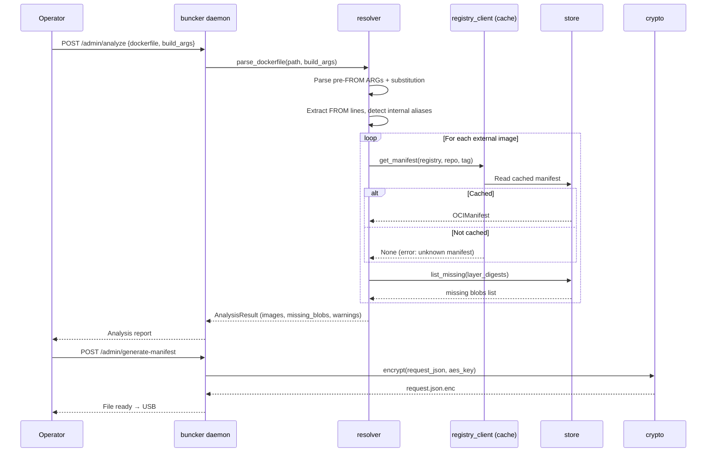
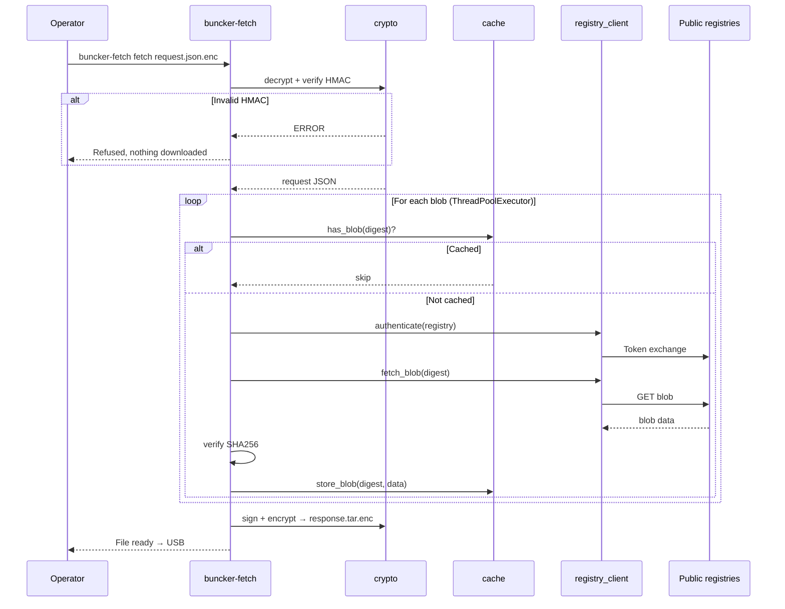
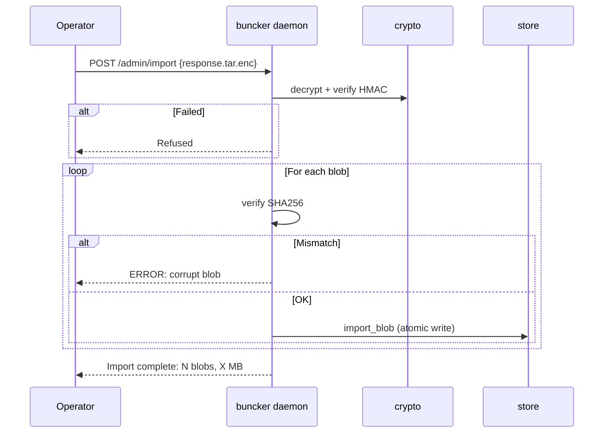
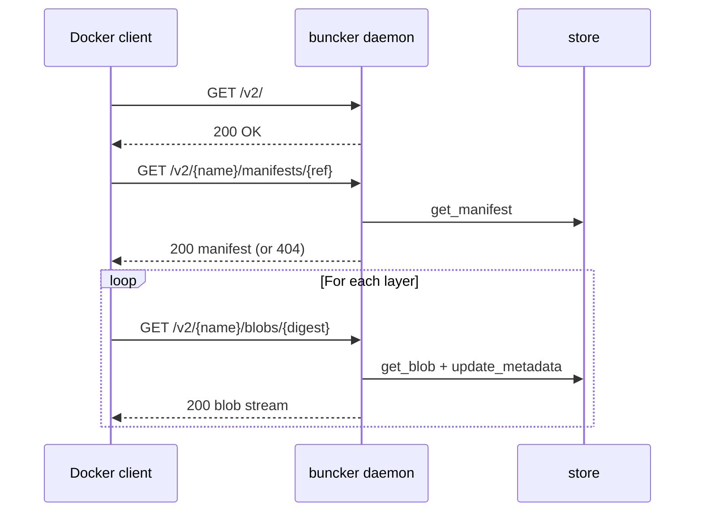

# 7. Core Workflows

## Workflow 1 - Dockerfile Analysis + Request Generation



## Workflow 2 - Online Fetch



## Workflow 3 - Import Response (offline)



## Workflow 4 - Docker Pull



## Workflow 5 - Setup / Pairing

```mermaid
sequenceDiagram
    participant OFF as Operator (offline)
    participant D as buncker daemon
    participant ON as Operator (online)
    participant F as buncker-fetch

    OFF->>D: buncker setup
    D->>D: generate_mnemonic() → 12 BIP-39 words
    D->>D: derive_keys + save config
    D-->>OFF: Display 12 words (write on paper)
    Note over OFF,ON: Human channel (verbal, paper)
    ON->>F: buncker-fetch pair
    F-->>ON: Enter 12 words
    ON->>F: word1 word2 ... word12
    F->>F: derive_keys + save config
    F-->>ON: Pairing OK
```

---
